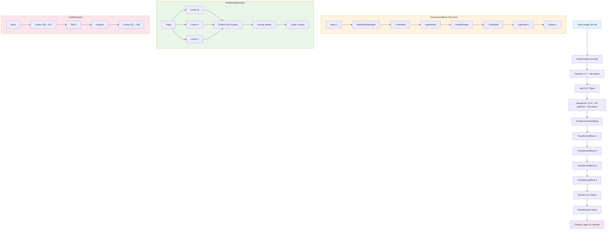

Encoder Only Transformer:

```mermaid
graph TD
    A[Input Image 28×28] --> B[PatchEmbed Conv2d]
    B --> C[Patches 7×7 = 49 tokens]
    C --> D[Add CLS Token]
    D --> E[Sequence: CLS + 49 patches = 50 tokens]
    E --> F[Positional Embedding]
    F --> G[TransformerBlock 1]
    G --> H[TransformerBlock 2]
    H --> I[TransformerBlock 3]
    I --> J[TransformerBlock 4]
    J --> K[Extract CLS Token]
    K --> L[Classification Head]
    L --> M[Output Logits 10 classes]

    subgraph TB ["TransformerBlock Structure"]
        TB1[Input x] --> TB2[MultiHeadAttention]
        TB2 --> TB3[+ Residual]
        TB3 --> TB4[LayerNorm]
        TB4 --> TB5[FeedForward]
        TB5 --> TB6[+ Residual]
        TB6 --> TB7[LayerNorm]
        TB7 --> TB8[Output x]
    end

    subgraph MHA ["MultiHeadAttention"]
        MHA1[Input] --> MHA2[Linear Q]
        MHA1 --> MHA3[Linear K]  
        MHA1 --> MHA4[Linear V]
        MHA2 --> MHA5[Scaled Dot-Product]
        MHA3 --> MHA5
        MHA4 --> MHA5
        MHA5 --> MHA6[Concat Heads]
        MHA6 --> MHA7[Linear Output]
    end

    subgraph FF ["FeedForward"]
        FF1[Input] --> FF2[Linear 128→512]
        FF2 --> FF3[ReLU]
        FF3 --> FF4[Dropout]
        FF4 --> FF5[Linear 512→128]
    end

    style A fill:#e1f5fe
    style M fill:#f3e5f5
    style TB fill:#fff3e0
    style MHA fill:#e8f5e8
    style FF fill:#fce4ec
```