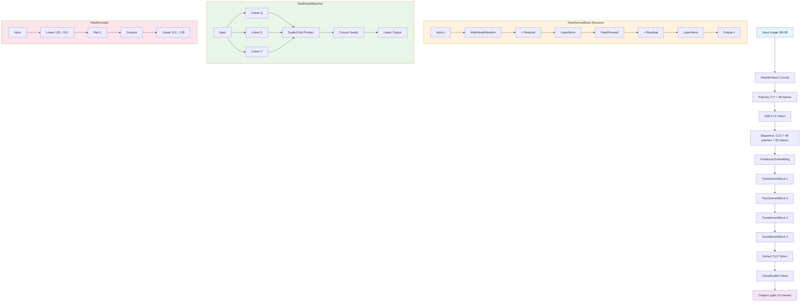
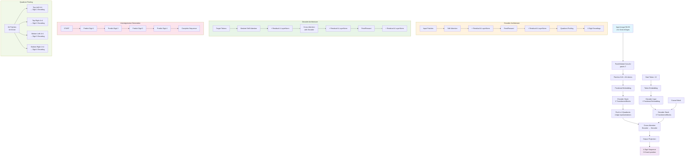

# Encoder Only Transformer & Encoder-Decoder for MNIST 4-Digit Recognition

This project implements Transformer-based models for recognizing sequences of digits in stacked MNIST images. The main focus is on two architectures:
- **Encoder Only Transformer** (ViT-style) for single-digit and multi-digit classification.
- **Encoder-Decoder Transformer** for sequence-to-sequence recognition of 4-digit numbers from 2x2 stacked MNIST images.

---

## Project Overview

- **Goal:** Recognize 4-digit numbers from images created by stacking four MNIST digits in a 2x2 grid (56x56 pixels).
- **Approach:** Use Vision Transformer (ViT) patch embedding and Transformer blocks to encode images, and a Transformer decoder to autoregressively generate digit sequences.
- **Dataset:** Based on the [ylecun/mnist](https://huggingface.co/datasets/ylecun/mnist) dataset, with custom code to generate 4-digit stacked samples.

---

## Dataset

- **Source:** [ylecun/mnist](https://huggingface.co/datasets/ylecun/mnist)
- **Format:** Parquet files with columns:
  - `image`: 28x28 grayscale digit (as bytes/blob)
  - `label`: integer digit (0-9)
- **4-digit dataset:** Each sample is a 2x2 grid of random MNIST digits, resulting in a 56x56 image and a label vector of length 4.

---

## Model Architectures

### Encoder Only Transformer

- **Input:** 28x28 MNIST image
- **Patch Embedding:** Conv2d to split into 7x7 patches (49 tokens)
- **CLS Token:** Added for classification
- **Positional Embedding:** Learnable
- **Transformer Blocks:** Stack of self-attention + feedforward layers
- **Output:** Classification logits for 10 classes

### Encoder-Decoder Transformer

- **Input:** 56x56 image (2x2 grid of digits)
- **Patch Embedding:** Conv2d to 8x8 patches (64 tokens)
- **Encoder:** Stack of Transformer blocks, pooling to 4 quadrant representations
- **Decoder:** Autoregressive Transformer, generates 4-digit sequence
- **Output:** Sequence of 4 digits (0-9)

---

## Model Diagram

Encoder Only Transformer Architecture:



Encoder-Decoder Transformer Architecture:



---

## Usage

### 1. Clone the Dataset

```bash
cd .charles/data
bash clone-mnist.sh
```

### 2. Install Requirements

Inside the repo folder,

```bash
uv sync
```

### 3. Configure Environment

Copy `.env.example` to `.env` and set your parameters (especially for Weights & Biases logging).

### 4. Train the Model

```bash
cd .charles

# Encoder only model
uv run encoder_only_models.py

# Encoder + Decoder model
uv run encoder_decode_models.py

```

- Training and validation progress will be logged to Weights & Biases (wandb).
- Model checkpoints are saved to `.data/models`.

---

## Results

- The encoder only model achieves high accuracy on a single digit recognition on par with CNN (Foundation Project), 97.57%, before sweeping.
- The encoder-decoder model achieves high accuracy on 4-digit recognition, valuation accuracy 87.5% before sweeping.
- Validation includes visualizations of predictions using a Braille-style display for easy inspection.

---

## Git Workflow: Maintaining Clean History (TO-DO)

### Squashing Commits

There are several ways to squash commits and maintain a clean Git history:

#### 1. Interactive Rebase (Most Common)

```bash
# Squash last 3 commits
git rebase -i HEAD~3

# Or squash commits since a specific commit
git rebase -i <commit-hash>

# In the editor, change 'pick' to 'squash' (or 's') for commits you want to squash
# Example:
# pick abc1234 Initial model implementation
# squash def5678 Fix attention mechanism
# squash ghi9012 Add dropout layer

# Save and exit, then edit the combined commit message
```

#### 2. Soft Reset and Re-commit

```bash
# Reset to specific commit but keep changes staged
git reset --soft HEAD~3

# Create a single commit with all changes
git commit -m "Implement encoder-decoder transformer for 4-digit MNIST recognition"
```

#### 3. Squash Merge (GitHub/GitLab)

```bash
# When merging pull requests, use squash merge option
# This combines all commits in the PR into a single commit

# Or manually:
git checkout main
git merge --squash feature-branch
git commit -m "Add encoder-decoder architecture with validation visualizations"
```

### Best Practices

1. **Before Pushing to Shared Branch:**
   ```bash
   # Clean up local commits before pushing
   git rebase -i origin/main
   ```

2. **Semantic Commit Messages:**
   ```bash
   # Use conventional commit format
   git commit -m "feat: add encoder-decoder transformer architecture"
   git commit -m "fix: resolve positional embedding dimension mismatch"
   git commit -m "docs: update README with architecture diagrams"
   ```

3. **Feature Branch Workflow:**
   ```bash
   # Create feature branch
   git checkout -b feature/encoder-decoder
   
   # Make commits during development
   git commit -m "wip: initial encoder implementation"
   git commit -m "wip: add decoder blocks"
   git commit -m "wip: fix attention masks"
   
   # Squash before merging
   git rebase -i main
   # Change all but first commit to 'squash'
   
   # Push clean history
   git push origin feature/encoder-decoder
   ```

4. **Undo Last Squash (if needed):**
   ```bash
   # If you made a mistake, use reflog to recover
   git reflog
   git reset --hard HEAD@{n}  # where n is the number from reflog
   ```

### Example Workflow for This Project

```bash
# 1. Start feature branch
git checkout -b feature/improve-validation

# 2. Make incremental commits during development
git commit -m "wip: add braille visualization"
git commit -m "wip: improve batch processing"
git commit -m "wip: fix display formatting"
git commit -m "wip: add error handling"

# 3. Squash commits before merging
git rebase -i main
# Result: Single clean commit
# "feat: enhance validation with braille-style visualization display"

# 4. Merge to main
git checkout main
git merge feature/improve-validation
```

---

## Hyperparameter Optimization with Wandb Sweeps (TO-DO)

### Overview
Use Weights & Biases sweeps to find optimal hyperparameters for both encoder-only and encoder-decoder models through Bayesian optimization.

### Sweep Configuration Files

- `sweep_config_encoder_only.yaml`: Hyperparameter ranges for single-digit classification
- `sweep_config_encoder_decoder.yaml`: Hyperparameter ranges for 4-digit sequence recognition

### Key Hyperparameters to Optimize

#### Encoder-Only Model
- Learning rate: 1e-5 to 1e-2 (log uniform)
- Batch size: [64, 128, 256]
- Model dimension: [128, 256, 384]
- Attention heads: [4, 8, 12]
- Transformer depth: [4, 6, 8]
- Patch size: [4, 7]
- Dropout: 0.1 to 0.3

#### Encoder-Decoder Model
- Learning rate: 5e-5 to 5e-3 (log uniform)
- Batch size: [32, 64, 128]
- Model dimension: [256, 384, 512]
- Attention heads: [8, 12, 16]
- Encoder depth: [6, 8, 10]
- Decoder depth: [6, 8, 10]
- Patch size: [7, 8]
- Dropout: 0.1 to 0.3

### Running Sweeps

#### 1. Create and Run Sweep Automatically
```bash
cd .charles

# Encoder-only model sweep (20 runs)
uv run wandb_sweeper.py --model encoder_only --count 20

# Encoder-decoder model sweep (15 runs)
uv run wandb_sweeper.py --model encoder_decoder --count 15
```

#### 2. Create Sweep Only (for manual agent management)
```bash
# Create sweep and get ID
uv run wandb_sweeper.py --model encoder_only --create-only

# Run agents manually (can run multiple in parallel)
wandb agent <sweep_id>
```

#### 3. Manual Sweep Creation
```bash
# Create sweep from config file
wandb sweep sweep_config_encoder_only.yaml

# Run sweep agent
wandb agent <sweep_id>
```

### Parallel Execution
```bash
# Run multiple agents in parallel for faster sweeps
wandb agent <sweep_id> &
wandb agent <sweep_id> &
wandb agent <sweep_id> &
wait
```

### Evaluation and Analysis

#### 1. Wandb Dashboard Analysis
- Navigate to your wandb project sweeps section
- Compare runs using parallel coordinates plot
- Analyze parameter importance plots
- Review best performing configurations

#### 2. Programmatic Analysis
```python
import wandb

# Get sweep results
api = wandb.Api()
sweep = api.sweep(f"{entity}/{project}/sweeps/{sweep_id}")

# Get best run
best_run = min(sweep.runs, key=lambda run: run.summary.get('val_accuracy', 0))
print(f"Best run: {best_run.name}")
print(f"Best config: {best_run.config}")
print(f"Best accuracy: {best_run.summary['val_accuracy']}")
```

#### 3. Best Model Selection Criteria
- **Primary**: Validation accuracy
- **Secondary**: Training stability (low variance across epochs)
- **Tertiary**: Training efficiency (convergence speed)
- **Quaternary**: Model size vs performance trade-off

### Expected Outcomes

#### Encoder-Only Model
- Target: >98% test accuracy on single digits
- Expected optimal: lr~1e-3, d_model=256, depth=6

#### Encoder-Decoder Model  
- Target: >90% validation accuracy on 4-digit sequences
- Expected optimal: lr~1e-4, d_model=384, enc_depth=8, dec_depth=6

### Post-Sweep Actions

1. **Retrain Best Models**: Use optimal hyperparameters for final training
2. **Model Ensemble**: Combine top 3-5 models for improved performance
3. **Documentation**: Update configs with optimal settings
4. **Production Deployment**: Save best models for inference

### Troubleshooting

- **OOM Errors**: Reduce batch_size or model dimensions
- **Slow Convergence**: Increase learning rate range upper bound
- **Poor Performance**: Check data preprocessing and model architecture
- **Sweep Failures**: Verify wandb authentication and project settings

---

## References

- [Vision Transformer (ViT)](https://arxiv.org/abs/2010.11929)
- [HuggingFace Datasets: ylecun/mnist](https://huggingface.co/datasets/ylecun/mnist)
- [PyTorch Documentation](https://pytorch.org/docs/stable/index.html)