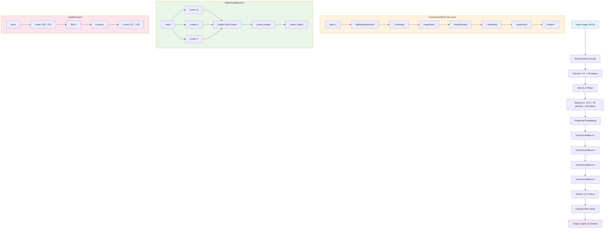
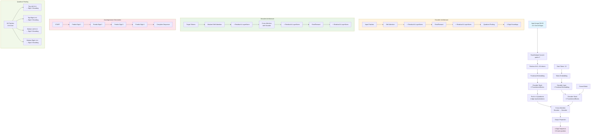

# Encoder Only Transformer & Encoder-Decoder for MNIST 4-Digit Recognition

This project implements Transformer-based models for recognizing sequences of digits in stacked MNIST images. The main focus is on two architectures:
- **Encoder Only Transformer** (ViT-style) for single-digit and multi-digit classification.
- **Encoder-Decoder Transformer** for sequence-to-sequence recognition of 4-digit numbers from 2x2 stacked MNIST images.

---

## Project Overview

- **Goal:** Recognize 4-digit numbers from images created by stacking four MNIST digits in a 2x2 grid (56x56 pixels).
- **Approach:** Use Vision Transformer (ViT) patch embedding and Transformer blocks to encode images, and a Transformer decoder to autoregressively generate digit sequences.
- **Dataset:** Based on the [ylecun/mnist](https://huggingface.co/datasets/ylecun/mnist) dataset, with custom code to generate 4-digit stacked samples.

---

## Dataset

- **Source:** [ylecun/mnist](https://huggingface.co/datasets/ylecun/mnist)
- **Format:** Parquet files with columns:
  - `image`: 28x28 grayscale digit (as bytes/blob)
  - `label`: integer digit (0-9)
- **4-digit dataset:** Each sample is a 2x2 grid of random MNIST digits, resulting in a 56x56 image and a label vector of length 4.

---

## Model Architectures

### Encoder Only Transformer

- **Input:** 28x28 MNIST image
- **Patch Embedding:** Conv2d to split into 7x7 patches (49 tokens)
- **CLS Token:** Added for classification
- **Positional Embedding:** Learnable
- **Transformer Blocks:** Stack of self-attention + feedforward layers
- **Output:** Classification logits for 10 classes

### Encoder-Decoder Transformer

- **Input:** 56x56 image (2x2 grid of digits)
- **Patch Embedding:** Conv2d to 8x8 patches (64 tokens)
- **Encoder:** Stack of Transformer blocks, pooling to 4 quadrant representations
- **Decoder:** Autoregressive Transformer, generates 4-digit sequence
- **Output:** Sequence of 4 digits (0-9)

---

## Model Diagram

Encoder Only Transformer Architecture:



Encoder-Decoder Transformer Architecture:



---

## Usage

### 1. Clone the Dataset

```bash
cd .charles/data
bash clone-mnist.sh
```

### 2. Install Requirements

Inside the repo folder,

```bash
uv sync
```

### 3. Configure Environment

Copy `.env.example` to `.env` and set your parameters (especially for Weights & Biases logging).

### 4. Train the Model

```bash
cd .charles

# Encoder only model
uv run encoder_only_models.py

# Encoder + Decoder model
uv run encoder_decode_models.py

```

- Training and validation progress will be logged to Weights & Biases (wandb).
- Model checkpoints are saved to `.data/models`.

---

## Results

- The encoder only model achieves high accuracy on a single digit recognition on par with CNN (Foundation Project), 97.57%, before sweeping.
- The encoder-decoder model achieves high accuracy on 4-digit recognition, valuation accuracy 87.5% before sweeping.
- Validation includes visualizations of predictions using a Braille-style display for easy inspection.

---

## References

- [Vision Transformer (ViT)](https://arxiv.org/abs/2010.11929)
- [HuggingFace Datasets: ylecun/mnist](https://huggingface.co/datasets/ylecun/mnist)
- [PyTorch Documentation](https://pytorch.org/docs/stable/index.html)

---