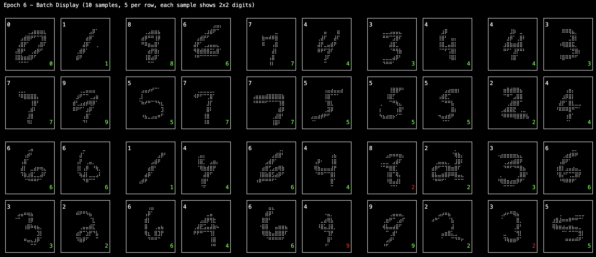

# Encoder Only Transformer & Encoder-Decoder for MNIST 4-Digit Recognition

This project implements Transformer-based models for recognizing sequences of digits in stacked MNIST images. The main focus is on two architectures:
- **Encoder Only Transformer** (ViT-style) for single-digit and multi-digit classification.
- **Encoder-Decoder Transformer** for sequence-to-sequence recognition of 4-digit numbers from 2x2 stacked MNIST images.

---

## Project Overview

- **Goal:** Recognize 4-digit numbers from images created by stacking four MNIST digits in a 2x2 grid (56x56 pixels).
- **Approach:** Use Vision Transformer (ViT) patch embedding and Transformer blocks to encode images, and a Transformer decoder to autoregressively generate digit sequences.
- **Dataset:** Based on the [ylecun/mnist](https://huggingface.co/datasets/ylecun/mnist) dataset, with custom code to generate 4-digit stacked samples.

---

## Dataset

- **Source:** [ylecun/mnist](https://huggingface.co/datasets/ylecun/mnist)
- **Format:** Parquet files with columns:
  - `image`: 28x28 grayscale digit (as bytes/blob)
  - `label`: integer digit (0-9)
- **4-digit dataset:** Each sample is a 2x2 grid of random MNIST digits, resulting in a 56x56 image and a label vector of length 4.

---

## Model Architectures

### Encoder Only Transformer

- **Input:** 28x28 MNIST image
- **Patch Embedding:** Conv2d to split into 7x7 patches (49 tokens)
- **CLS Token:** Added for classification
- **Positional Embedding:** Learnable
- **Transformer Blocks:** Stack of self-attention + feedforward layers
- **Output:** Classification logits for 10 classes

### Encoder-Decoder Transformer

- **Input:** 56x56 image (2x2 grid of digits)
- **Patch Embedding:** Conv2d to 8x8 patches (64 tokens)
- **Encoder:** Stack of Transformer blocks, pooling to 4 quadrant representations
- **Decoder:** Autoregressive Transformer, generates 4-digit sequence
- **Output:** Sequence of 4 digits (0-9)

---

## Model Diagram

Encoder Only Transformer Architecture:


Encoder-Decoder Transformer Architecture:


---

## Visualizations

### Overview

The project includes comprehensive visualization tools to analyze learned representations and attention patterns in transformer models. These visualizations help understand:
- How patch embeddings cluster in high-dimensional space
- What patterns the attention mechanism focuses on
- Whether the model learns meaningful digit representations
- How different digits are distinguished in the embedding space

### Generating Visualizations

```bash
cd .charles

# For encoder-only model
export MODEL_TYPE=encoder_only
export MODEL_PATH=.data/models/vit_mnist_epoch_8.pth
export NUM_SAMPLES=1000
uv run viz.py

# For encoder-decoder model
export MODEL_TYPE=encoder_decoder
export MODEL_PATH=.data/models/encoder_decoder_4digit_epoch_8.pth
export NUM_SAMPLES=500
uv run viz.py
```

Generated visualizations are saved to `.data/visualizations/`:

### Visualization Types and Interpretation

#### 1. t-SNE Embeddings (`*_tsne.png`)

**Encoder-Only Model:**


**Encoder-Decoder Model:**


**What it shows:** 2D projection of high-dimensional patch embeddings using t-SNE algorithm.

**Comparative Analysis - Encoder-Only vs Encoder-Decoder:**

The t-SNE visualizations reveal fundamental differences between the two architectures:

**Encoder-Only Characteristics:**
- **More structured clustering:** Shows clearer, more compact clusters for each digit class
- **Better separation:** Distinct boundaries between digit types with minimal overlap
- **Focused representation:** Each digit forms a coherent cluster, indicating the model learns digit-specific features
- **Spatial organization:** Clusters are well-distributed across the 2D space

**Encoder-Decoder Characteristics:**
- **More distributed embeddings:** Points are more scattered across the space
- **Complex patterns:** Shows multiple sub-clusters for some digits, reflecting the complexity of processing 4-digit sequences
- **Mixed representations:** Some digit classes show more overlap, indicating the model must balance individual digit recognition with sequence understanding
- **Context dependency:** The more scattered nature reflects that patch embeddings are influenced by their position in the 4-digit sequence

**Key Differences:**
1. **Task complexity:** Encoder-only focuses on single digit classification, while encoder-decoder must handle sequence-to-sequence mapping
2. **Representation purpose:** Encoder-only embeddings optimize for digit classification; encoder-decoder embeddings serve as input for sequence generation
3. **Context influence:** Encoder-decoder embeddings are influenced by the surrounding digits in the 2×2 grid

**How to interpret:**
- **Clusters by color:** Each color represents a different digit (0-9)
- **Spatial separation:** Well-separated clusters indicate the model learned distinct representations for each digit
- **Overlap regions:** Areas where different colors mix suggest the model has difficulty distinguishing between those digits
- **Density patterns:** Dense clusters show consistent representations, sparse areas indicate high variance

**Good signs:**
- Clear separation between digit classes
- Tight, well-defined clusters for each digit
- Minimal overlap between different digit regions

**Potential issues:**
- Overlapping clusters (digits 6 and 9, 3 and 8 commonly confused)
- Very spread out or fragmented clusters
- No clear structure or random distribution

#### 2. PCA with HDBSCAN Clustering (`*_pca_hdbscan.png`)

**Encoder-Only Model:**


**Encoder-Decoder Model:**


**What it shows:** 
- **Left panel:** PCA projection colored by true digit labels (0-9)
- **Right panel:** Same projection colored by HDBSCAN discovered clusters

**Comparative Analysis - Encoder-Only vs Encoder-Decoder:**

**Encoder-Only Results:**
- **Clear linear separation:** PCA reveals strong linear separability between digit classes
- **Coherent clustering:** HDBSCAN discovers ~15 clusters (right panel) that largely align with digit categories
- **High cluster purity:** Most discovered clusters contain predominantly one digit type
- **Noise handling:** HDBSCAN effectively identifies outliers (shown in purple/dark colors)

**Encoder-Decoder Results:**
- **More complex structure:** PCA shows a more curved, manifold-like distribution
- **Higher cluster count:** HDBSCAN discovers ~30+ clusters, indicating more complex internal structure
- **Mixed cluster composition:** Some clusters contain multiple digit types, reflecting sequence context
- **Hierarchical patterns:** The clustering reveals sub-structures within digit categories

**Key Insights:**

1. **Dimensionality reduction effectiveness:**
   - Encoder-only: PCA captures most variance in first two components (clear linear patterns)
   - Encoder-decoder: More complex manifold structure requires higher dimensions for full representation

2. **Clustering alignment:**
   - Encoder-only: Strong alignment between true labels and discovered clusters
   - Encoder-decoder: More complex clustering reflects the model's need to encode positional and contextual information

3. **Model complexity:**
   - Encoder-only: Simpler, more interpretable embedding space optimized for classification
   - Encoder-decoder: More complex embedding space that encodes both digit identity and sequential relationships

**Interpretation Guidelines:**

**For Encoder-Only:**
- Look for 10 main cluster regions corresponding to digits 0-9
- Expect high overlap between left and right panels
- Noise points indicate difficult-to-classify samples

**For Encoder-Decoder:**
- Expect more clusters than digits due to positional encoding
- Look for sub-clusters within digit types
- Higher noise levels are normal due to sequence complexity

**Quality Indicators:**
- **Good:** Discovered clusters show some correspondence to digit labels
- **Concerning:** Completely random clustering with no relationship to digit identity
- **Excellent:** Clear hierarchical structure where sub-clusters make semantic sense

#### 3. UMAP/PCA with K-Means Clustering (Fallback)

When HDBSCAN is unavailable, the system falls back to PCA with K-Means clustering:

**Left panel - Digit Labels:** Shows embeddings colored by true digit labels (0-9)
**Right panel - K-Means Clusters:** Shows embeddings colored by K-Means clustering results (typically K=10)

**How to interpret:**
- **Alignment between panels:** Good models show similar clustering patterns in both panels
- **Cluster coherence:** Each discovered cluster should predominantly contain one digit type
- **Boundary definition:** Clear boundaries between clusters indicate well-learned representations
- **Noise points:** Scattered points between clusters may indicate difficult samples or model uncertainty

**Analysis questions:**
- Do the discovered clusters align with true digit labels?
- Are there unexpected cluster patterns that reveal model biases?
- Which digits are most commonly clustered together (indicating confusion)?

#### 4. Attention Maps

The attention visualization system extracts and processes attention weights from the first transformer block to create interpretable heatmaps. Here's the detailed technical mechanism:

##### Technical Pipeline Overview

**Step 1: Attention Weight Extraction (`get_attention_weights` method)**
```python
# From viz.py lines 138-171
def get_attention_weights(self, x, attention_block):
    """Extract attention weights from transformer block"""
    B, N, D = x.shape
    
    # Get Q, K, V from attention layer
    Q = attention_layer.w_q(x)  # Query projections
    K = attention_layer.w_k(x)  # Key projections
    
    # Reshape for multi-head attention
    n_heads = attention_layer.n_heads
    d_k = attention_layer.d_k
    
    Q = Q.view(B, N, n_heads, d_k).transpose(1, 2)  # (B, n_heads, N, d_k)
    K = K.view(B, N, n_heads, d_k).transpose(1, 2)  # (B, n_heads, N, d_k)
    
    # Compute attention scores
    scores = torch.matmul(Q, K.transpose(-2, -1)) / (d_k ** 0.5)
    attn_weights = torch.softmax(scores, dim=-1)  # (B, n_heads, N, N)
    
    # Average across heads - THIS IS THE KEY AGGREGATION STEP
    attn_weights = attn_weights.mean(dim=1)  # (B, N, N)
    
    return attn_weights
```

**Key Technical Details:**
- **Multi-head averaging**: `attn_weights.mean(dim=1)` averages attention patterns across all attention heads
- **Attention matrix dimensions**: Each head produces an (N×N) attention matrix where N = number of tokens (patches + CLS)
- **Score computation**: Standard scaled dot-product attention: `softmax(QK^T / √d_k)`

**Step 2: Patch Embedding Extraction (`extract_patch_embeddings` method)**
```python
# From viz.py lines 65-95 (encoder-only case)
# Forward pass through patch embedding and positional encoding
B = img.size(0)
x = self.model.patch(img)  # (B, n_patches, d_model) - Convert image to patches
cls = self.model.cls_token.expand(B, -1, -1)  # Add CLS token
x = torch.cat([cls, x], dim=1)  # (B, n_patches+1, d_model)
x = self.model.pos(x)  # Add positional embeddings

# Extract attention weights from first transformer block
attn_block = self.model.transformer_blocks[0]
attn_weights_batch = self.get_attention_weights(x, attn_block)
```

**Step 3: Heatmap Generation and Projection (`_plot_single_digit_attention` method)**
```python
# From viz.py lines 290-320
# Attention map (excluding CLS token)
# Average attention from all tokens to all tokens, excluding CLS
patch_attn = attn[1:, 1:].mean(axis=0)  # Average attention received by each patch

# Reshape to spatial dimensions
patch_size = int(np.sqrt(len(patch_attn)))  # e.g., 7x7 = 49 patches → patch_size = 7
attn_map = patch_attn.reshape(patch_size, patch_size)  # (7, 7) attention grid

# Resize attention map to match image size using scipy
attn_resized = zoom(attn_map, (28/patch_size, 28/patch_size))  # Scale to 28x28

# Overlay attention on image
axes[1, i].imshow(img, cmap='gray', alpha=0.7)        # Original image (70% opacity)
axes[1, i].imshow(attn_resized, cmap='hot', alpha=0.5) # Attention overlay (50% opacity)
```

##### Detailed Mechanism Breakdown

**1. Multi-Head Attention Aggregation**
```
Input: attn_weights shape (B, n_heads, N, N)
│
├─ Head 1: (B, N, N) - Attention pattern from head 1
├─ Head 2: (B, N, N) - Attention pattern from head 2  
├─ Head 3: (B, N, N) - Attention pattern from head 3
└─ Head 4: (B, N, N) - Attention pattern from head 4
│
▼ Average across heads: .mean(dim=1)
│
Output: (B, N, N) - Unified attention pattern
```

**2. Attention Processing Pipeline**
```
Attention Matrix (N×N) where N = 50 (49 patches + 1 CLS)
│
├─ Exclude CLS token: attn[1:, 1:] → (49×49)
│
├─ Average attention received: .mean(axis=0) → (49,)
│   │ Each patch gets a single attention score
│   │ Score = average of how much all patches attend to this patch
│
├─ Reshape to spatial grid: .reshape(7, 7) → (7×7)
│   │ Convert linear patch sequence back to 2D spatial layout
│
└─ Upscale to image resolution: zoom() → (28×28)
    │ Bilinear interpolation to match original image size
```

**3. Color Spectrum Mapping**
```python
# Color mapping happens via matplotlib's 'hot' colormap
# Low attention values → Dark colors (black/dark red)  
# High attention values → Bright colors (yellow/white)

plt.imshow(attn_resized, cmap='hot', alpha=0.5)
```

**Color Scale Interpretation:**
- **Black/Dark Red**: Low attention (model ignores these regions)
- **Red/Orange**: Medium attention  
- **Yellow/White**: High attention (model focuses here)

##### Single Digit (`encoder_only_attention_maps.png`)


**What it shows:** 
- Top row: Original MNIST digits (28×28 grayscale)
- Bottom row: Attention heatmaps overlaid on digits

**Technical Specifications:**
- **Patch resolution**: 7×7 patches from 28×28 images (49 total patches)
- **Attention source**: First transformer block only (captures early attention patterns)
- **Aggregation method**: Average across 4 attention heads, then average attention received per patch
- **Visualization**: Bilinear upsampling from 7×7 to 28×28, 'hot' colormap with 50% transparency

**Code Reference for Single Digit Processing:**
```python
# viz.py lines 290-320: Core attention processing
patch_attn = attn[1:, 1:].mean(axis=0)  # (49,) - attention per patch
attn_map = patch_attn.reshape(patch_size, patch_size)  # (7, 7)
attn_resized = zoom(attn_map, (28/patch_size, 28/patch_size))  # (28, 28)
```

**How to interpret:**
- **Hot spots (red/yellow):** Areas the model focuses on most
- **Cool areas (blue/black):** Areas the model ignores
- **Attention patterns:** Should align with discriminative features of each digit

**Expected patterns:**
- **Digit 0:** Attention on the outer ring, avoiding the center hole
- **Digit 1:** Focused attention on the central vertical line
- **Digit 4:** Attention on the junction where lines meet
- **Digit 8:** Attention on both loops and the connecting waist
- **Digit 7:** Strong attention on the top horizontal line and diagonal

**Concerning patterns:**
- Uniform attention (model not learning discriminative features)
- Attention on image borders or noise
- No clear relationship between attention and digit structure

##### 4-Digit Stacked (`encoder_decoder_attention_maps.png`)


**What it shows:**
- Top row: 56×56 stacked 4-digit images (2×2 grid)
- Bottom row: Attention patterns across the entire image

**Technical Specifications:**
- **Patch resolution**: 8×8 patches from 56×56 images (64 total patches)
- **Attention source**: First encoder transformer block
- **Processing difference**: No CLS token exclusion (encoder-decoder uses different architecture)
- **Visualization**: Bilinear upsampling from 8×8 to 56×56

**Code Reference for 4-Digit Processing:**
```python
# viz.py lines 345-365: 4-digit specific processing  
patch_attn = attn.mean(axis=0)  # (64,) - no CLS token to exclude
attn_map = patch_attn.reshape(8, 8)  # (8, 8)
attn_resized = zoom(attn_map, (56/8, 56/8))  # (56, 56)
```

**How to interpret:**
- **Quadrant attention:** Model should show attention in all four quadrants
- **Balanced focus:** Attention should be distributed across all digit positions
- **Digit-specific patterns:** Each quadrant should show attention patterns specific to its digit

**Analysis points:**
- Does the model attend to all four digits equally?
- Are attention patterns consistent with single-digit patterns?
- Does the model show bias toward certain positions (e.g., top-left)?

##### Key Differences: Single vs 4-Digit Attention Processing

| Aspect | Single Digit (Encoder-Only) | 4-Digit (Encoder-Decoder) |
|--------|----------------------------|---------------------------|
| **Input Size** | 28×28 pixels | 56×56 pixels |
| **Patch Grid** | 7×7 patches (49 total) | 8×8 patches (64 total) |
| **Token Structure** | CLS + 49 patches = 50 tokens | 64 patches (no CLS) |
| **Attention Processing** | `attn[1:, 1:].mean(axis=0)` | `attn.mean(axis=0)` |
| **Spatial Upsampling** | 7×7 → 28×28 (4× scaling) | 8×8 → 56×56 (7× scaling) |
| **Architecture Source** | `model.transformer_blocks[0]` | `model.encoder.encoder_blocks[0]` |

##### Advanced Analysis: Why Average Across Heads?

**Multi-head attention theory**: Each attention head captures different types of relationships:
- **Head 1**: Might focus on edges and contours
- **Head 2**: Might capture spatial relationships  
- **Head 3**: Might attend to texture patterns
- **Head 4**: Might focus on global shape

**Averaging rationale**:
```python
# Code reference: viz.py line 167
attn_weights = attn_weights.mean(dim=1)  # Average across heads
```

**Why this works**:
1. **Noise reduction**: Averaging smooths out head-specific noise
2. **Consensus view**: Shows where multiple heads agree on importance
3. **Interpretability**: Single unified attention map is easier to visualize than 4 separate head maps
4. **Biological inspiration**: Similar to how ensemble methods improve robustness

**Alternative approaches** (not implemented but possible):
- **Max pooling**: `attn_weights.max(dim=1)[0]` - highlights strongest attention from any head
- **Weighted average**: Weight heads by their validation performance
- **Head-specific visualization**: Show each head separately for detailed analysis

##### Troubleshooting Attention Visualizations

**Problem: Uniform attention across image**
```python
# Check if attention weights are properly computed
print(f"Attention range: {attn_weights.min():.4f} to {attn_weights.max():.4f}")
print(f"Attention std: {attn_weights.std():.4f}")
```
- **Expected**: Wide range with clear peaks and valleys
- **Problem**: Very narrow range or all values similar

**Problem: Attention focuses on borders**
```python
# Verify patch embedding doesn't include padding artifacts
patch_embeds = model.patch(img)
print(f"Patch embedding shape: {patch_embeds.shape}")
print(f"Patch values range: {patch_embeds.min():.4f} to {patch_embeds.max():.4f}")
```

**Problem: Inconsistent attention patterns**
- **Check**: Is the model properly trained? Early training shows random attention
- **Solution**: Use models trained for >5 epochs for meaningful attention patterns

### Detailed Analysis Workflow

#### 1. Model Quality Assessment
```
1. Check t-SNE plot for cluster separation
2. Verify UMAP/PCA clustering alignment
3. Examine attention patterns for sensible focus
4. Look for systematic biases or failure modes
```

#### 2. Comparative Analysis
```
1. Compare encoder-only vs encoder-decoder attention patterns
2. Analyze which digits are most/least well-separated
3. Identify common confusion patterns
4. Assess model confidence through cluster density
```

#### 3. Troubleshooting Guide

**Problem: Poor cluster separation in t-SNE**
- Solution: Increase model depth, adjust learning rate, add regularization

**Problem: Uniform attention maps**
- Solution: Reduce dropout, increase attention heads, check for gradient flow issues

**Problem: Clustering doesn't match digit labels**
- Solution: Verify data preprocessing, check for label errors, increase training time

**Problem: Attention focuses on image borders**
- Solution: Add padding during training, check patch embedding implementation

### Advanced Comparative Analysis

#### Cross-Architecture Insights

**Embedding Space Characteristics:**
```
Encoder-Only:
- Optimized for digit discrimination
- Compact, well-separated clusters
- Linear separability in reduced dimensions
- Lower complexity embedding space

Encoder-Decoder:
- Optimized for sequence generation
- More distributed representations
- Non-linear manifold structure
- Higher complexity embedding space
```

**Performance Implications:**
- **Encoder-only:** Better digit classification accuracy due to focused optimization
- **Encoder-decoder:** More generalizable representations for sequence tasks but potentially lower single-digit accuracy

**Model Selection Guidelines:**
- Choose encoder-only for single-digit classification tasks
- Choose encoder-decoder for sequence-to-sequence digit recognition
- Consider encoder-only for transfer learning to other single-digit tasks
- Consider encoder-decoder for complex multi-digit reasoning tasks

---

## Usage

### 1. Clone the Dataset

```bash
cd .charles/data
bash clone-mnist.sh
```

### 2. Install Requirements

Inside the repo folder,

```bash
uv sync
```

### 3. Configure Environment

Copy `.env.example` to `.env` and set your parameters (especially for Weights & Biases logging).

### 4. Train the Model

```bash
cd .charles

# Encoder only model
uv run encoder_only_models.py

# Encoder + Decoder model
uv run encoder_decode_models.py

```

- Training and validation progress will be logged to Weights & Biases (wandb).
- Model checkpoints are saved to `.data/models`.

---

## Results

- The encoder only model achieves high accuracy on a single digit recognition on par with CNN (Foundation Project), 97.57%, before sweeping.
- The encoder-decoder model achieves high accuracy on 4-digit recognition, valuation accuracy 87.5% before sweeping.
- Validation includes visualizations of predictions using a Braille-style display for easy inspection.
- **Embedding visualizations** reveal well-separated digit clusters and focused attention patterns, confirming the models learn meaningful digit representations.

---

## Git Workflow: Maintaining Clean History (TO-DO)

### Squashing Commits

There are several ways to squash commits and maintain a clean Git history:

#### 1. Interactive Rebase (Most Common)

```bash
# Squash last 3 commits
git rebase -i HEAD~3

# Or squash commits since a specific commit
git rebase -i <commit-hash>

# In the editor, change 'pick' to 'squash' (or 's') for commits you want to squash
# Example:
# pick abc1234 Initial model implementation
# squash def5678 Fix attention mechanism
# squash ghi9012 Add dropout layer

# Save and exit, then edit the combined commit message
```

#### 2. Soft Reset and Re-commit

```bash
# Reset to specific commit but keep changes staged
git reset --soft HEAD~3

# Create a single commit with all changes
git commit -m "Implement encoder-decoder transformer for 4-digit MNIST recognition"
```

#### 3. Squash Merge (GitHub/GitLab)

```bash
# When merging pull requests, use squash merge option
# This combines all commits in the PR into a single commit

# Or manually:
git checkout main
git merge --squash feature-branch
git commit -m "Add encoder-decoder architecture with validation visualizations"
```

### Best Practices

1. **Before Pushing to Shared Branch:**
   ```bash
   # Clean up local commits before pushing
   git rebase -i origin/main
   ```

2. **Semantic Commit Messages:**
   ```bash
   # Use conventional commit format
   git commit -m "feat: add encoder-decoder transformer architecture"
   git commit -m "fix: resolve positional embedding dimension mismatch"
   git commit -m "docs: update README with architecture diagrams"
   ```

3. **Feature Branch Workflow:**
   ```bash
   # Create feature branch
   git checkout -b feature/encoder-decoder
   
   # Make commits during development
   git commit -m "wip: initial encoder implementation"
   git commit -m "wip: add decoder blocks"
   git commit -m "wip: fix attention masks"
   
   # Squash before merging
   git rebase -i main
   # Change all but first commit to 'squash'
   
   # Push clean history
   git push origin feature/encoder-decoder
   ```

4. **Undo Last Squash (if needed):**
   ```bash
   # If you made a mistake, use reflog to recover
   git reflog
   git reset --hard HEAD@{n}  # where n is the number from reflog
   ```

### Example Workflow for This Project

```bash
# 1. Start feature branch
git checkout -b feature/improve-validation

# 2. Make incremental commits during development
git commit -m "wip: add braille visualization"
git commit -m "wip: improve batch processing"
git commit -m "wip: fix display formatting"
git commit -m "wip: add error handling"

# 3. Squash commits before merging
git rebase -i main
# Result: Single clean commit
# "feat: enhance validation with braille-style visualization display"

# 4. Merge to main
git checkout main
git merge feature/improve-validation
```

---

## Hyperparameter Optimization with Wandb Sweeps (TO-DO)

### Overview
Use Weights & Biases sweeps to find optimal hyperparameters for both encoder-only and encoder-decoder models through Bayesian optimization.

### Sweep Configuration Files

- `sweep_config_encoder_only.yaml`: Hyperparameter ranges for single-digit classification
- `sweep_config_encoder_decoder.yaml`: Hyperparameter ranges for 4-digit sequence recognition

### Key Hyperparameters to Optimize

#### Encoder-Only Model
- Learning rate: 1e-5 to 1e-2 (log uniform)
- Batch size: [64, 128, 256]
- Model dimension: [128, 256, 384]
- Attention heads: [4, 8, 12]
- Transformer depth: [4, 6, 8]
- Patch size: [4, 7]
- Dropout: 0.1 to 0.3

#### Encoder-Decoder Model
- Learning rate: 5e-5 to 5e-3 (log uniform)
- Batch size: [32, 64, 128]
- Model dimension: [256, 384, 512]
- Attention heads: [8, 12, 16]
- Encoder depth: [6, 8, 10]
- Decoder depth: [6, 8, 10]
- Patch size: [7, 8]
- Dropout: 0.1 to 0.3

### Running Sweeps

#### 1. Create and Run Sweep Automatically
```bash
cd .charles

# Encoder-only model sweep (20 runs)
uv run wandb_sweeper.py --model encoder_only --count 20

# Encoder-decoder model sweep (15 runs)
uv run wandb_sweeper.py --model encoder_decoder --count 15
```

#### 2. Create Sweep Only (for manual agent management)
```bash
# Create sweep and get ID
uv run wandb_sweeper.py --model encoder_only --create-only

# Run agents manually (can run multiple in parallel)
wandb agent <sweep_id>
```

#### 3. Manual Sweep Creation
```bash
# Create sweep from config file
wandb sweep sweep_config_encoder_only.yaml

# Run sweep agent
wandb agent <sweep_id>
```

### Parallel Execution
```bash
# Run multiple agents in parallel for faster sweeps
wandb agent <sweep_id> &
wandb agent <sweep_id> &
wandb agent <sweep_id> &
wait
```

### Evaluation and Analysis

#### 1. Wandb Dashboard Analysis
- Navigate to your wandb project sweeps section
- Compare runs using parallel coordinates plot
- Analyze parameter importance plots
- Review best performing configurations

#### 2. Programmatic Analysis
```python
import wandb

# Get sweep results
api = wandb.Api()
sweep = api.sweep(f"{entity}/{project}/sweeps/{sweep_id}")

# Get best run
best_run = min(sweep.runs, key=lambda run: run.summary.get('val_accuracy', 0))
print(f"Best run: {best_run.name}")
print(f"Best config: {best_run.config}")
print(f"Best accuracy: {best_run.summary['val_accuracy']}")
```

#### 3. Best Model Selection Criteria
- **Primary**: Validation accuracy
- **Secondary**: Training stability (low variance across epochs)
- **Tertiary**: Training efficiency (convergence speed)
- **Quaternary**: Model size vs performance trade-off

### Expected Outcomes

#### Encoder-Only Model
- Target: >98% test accuracy on single digits
- Expected optimal: lr~1e-3, d_model=256, depth=6

#### Encoder-Decoder Model  
- Target: >90% validation accuracy on 4-digit sequences
- Expected optimal: lr~1e-4, d_model=384, enc_depth=8, dec_depth=6

### Post-Sweep Actions

1. **Retrain Best Models**: Use optimal hyperparameters for final training
2. **Model Ensemble**: Combine top 3-5 models for improved performance
3. **Documentation**: Update configs with optimal settings
4. **Production Deployment**: Save best models for inference

### Troubleshooting

- **OOM Errors**: Reduce batch_size or model dimensions
- **Slow Convergence**: Increase learning rate range upper bound
- **Poor Performance**: Check data preprocessing and model architecture
- **Sweep Failures**: Verify wandb authentication and project settings

---

## References

- [Vision Transformer (ViT)](https://arxiv.org/abs/2010.11929)
- [HuggingFace Datasets: ylecun/mnist](https://huggingface.co/datasets/ylecun/mnist)
- [PyTorch Documentation](https://pytorch.org/docs/stable/index.html)


## Appendix: Braille Visualization per Epoch

Braille sample predictions after each epoch:

Epoch 2 - 10 Sample 2x2 Grids


Epoch 3 - 10 Sample 2x2 Grids


Epoch 4 - 10 Sample 2x2 Grids


Epoch 5 - 10 Sample 2x2 Grids


Epoch 6 - 10 Sample 2x2 Grids


Epoch 7 - 10 Sample 2x2 Grids


Epoch 8 - 10 Sample 2x2 Grids


Training output log sample:

<pre><code style="
    font-family: 'JetBrains Mono', 'Cascadia Code', 'Source Code Pro', 'Ubuntu Mono', 'Roboto Mono', 'Inconsolata', monospace;
    font-size: 13px;
    line-height: 1.2;
    background-color: #1e1e1e;
    color: #d4d4d4;
    padding: 16px;
    border-radius: 4px;
    overflow-x: auto;
    white-space: pre;
">

============================================================
STARTING DATA PREPARATION
============================================================
Loading MNIST data from:
  Train files: .data/ylecun/mnist/train*.parquet
  Test files: .data/ylecun/mnist/test*.parquet
Loading single digit datasets...
Loaded 60000 training samples and 10000 test samples
Creating datasets:
  Training samples: 30000
  Test samples: 5000
  Batch sizes: train=128, test=128
Creating 4-digit dataset with 30000 samples...
Creating 4-digit dataset with 5000 samples...
Data preparation completed!
============================================================
Running in default mode from .env
Epoch 1/8, Batch 0, Loss: 2.5349, Acc: 0.00%
Epoch 1/8, Batch 10, Loss: 2.3663, Acc: 0.00%
Epoch 1/8, Batch 20, Loss: 2.3158, Acc: 0.04%
Epoch 1/8, Batch 30, Loss: 2.3105, Acc: 0.03%
Epoch 1/8, Batch 40, Loss: 2.3038, Acc: 0.02%
Epoch 1/8, Batch 50, Loss: 2.3024, Acc: 0.05%
Epoch 1/8, Batch 60, Loss: 2.3215, Acc: 0.05%
Epoch 1/8, Batch 70, Loss: 2.3000, Acc: 0.04%
Epoch 1/8, Batch 80, Loss: 2.3177, Acc: 0.04%
Epoch 1/8, Batch 90, Loss: 2.3247, Acc: 0.03%
Epoch 1/8, Batch 100, Loss: 2.2664, Acc: 0.03%
Epoch 1/8, Batch 110, Loss: 2.2895, Acc: 0.04%
Epoch 1/8, Batch 120, Loss: 2.2347, Acc: 0.04%
Epoch 1/8, Batch 130, Loss: 2.2346, Acc: 0.04%
Epoch 1/8, Batch 140, Loss: 2.2037, Acc: 0.03%
Epoch 1/8, Batch 150, Loss: 2.1755, Acc: 0.03%
Epoch 1/8, Batch 160, Loss: 2.1844, Acc: 0.03%
Epoch 1/8, Batch 170, Loss: 2.1481, Acc: 0.03%
Epoch 1/8, Batch 180, Loss: 2.1692, Acc: 0.03%
Epoch 1/8, Batch 190, Loss: 2.1197, Acc: 0.04%
Epoch 1/8, Batch 200, Loss: 2.1002, Acc: 0.04%
Epoch 1/8, Batch 210, Loss: 2.0970, Acc: 0.04%
Epoch 1/8, Batch 220, Loss: 2.0445, Acc: 0.04%
Epoch 1/8, Batch 230, Loss: 2.0806, Acc: 0.04%

============================================================
EPOCH 1 VALIDATION - FIRST 10 SAMPLES
============================================================

Legend: <span style="filter: contrast(70%) brightness(190%);color:gray;">Expected (top-left)</span> | <span style="filter: contrast(70%) brightness(190%);color:green;">Predicted Correct (bottom-right)</span> | <span style="filter: contrast(70%) brightness(190%);color:red;">Predicted Wrong (bottom-right)</span>
========================================================================================================================================================================================================
Epoch 1 - Batch Display (10 samples, 5 per row, each sample shows 2x2 digits)

┌──────────────┐ ┌──────────────┐    ┌──────────────┐ ┌──────────────┐    ┌──────────────┐ ┌──────────────┐    ┌──────────────┐ ┌──────────────┐    ┌──────────────┐ ┌──────────────┐
│<span style="filter: contrast(70%) brightness(190%);color:gray;">4</span>⠀⠀⠀⠀⠀⠀⠀⠀⠀⠀⠀⠀⠀│ │<span style="filter: contrast(70%) brightness(190%);color:gray;">0</span>⠀⠀⠀⠀⠀⠀⠀⠀⠀⠀⠀⠀⠀│    │<span style="filter: contrast(70%) brightness(190%);color:gray;">8</span>⠀⠀⠀⠀⠀⠀⠀⠀⠀⠀⠀⠀⠀│ │<span style="filter: contrast(70%) brightness(190%);color:gray;">4</span>⠀⠀⠀⠀⠀⠀⠀⠀⠀⠀⠀⠀⠀│    │<span style="filter: contrast(70%) brightness(190%);color:gray;">7</span>⠀⠀⠀⠀⠀⠀⠀⠀⠀⠀⠀⠀⠀│ │<span style="filter: contrast(70%) brightness(190%);color:gray;">9</span>⠀⠀⠀⠀⠀⠀⠀⠀⠀⠀⠀⠀⠀│    │<span style="filter: contrast(70%) brightness(190%);color:gray;">5</span>⠀⠀⠀⠀⠀⠀⠀⠀⠀⠀⠀⠀⠀│ │<span style="filter: contrast(70%) brightness(190%);color:gray;">9</span>⠀⠀⠀⠀⠀⠀⠀⠀⠀⠀⠀⠀⠀│    │<span style="filter: contrast(70%) brightness(190%);color:gray;">9</span>⠀⠀⠀⠀⠀⠀⠀⠀⠀⠀⠀⠀⠀│ │<span style="filter: contrast(70%) brightness(190%);color:gray;">6</span>⠀⠀⠀⠀⠀⠀⠀⣀⠀⠀⠀⠀⠀│
│⠀⠀⠀⠀⠀⢠⣶⡄⢰⣶⠀⠀⠀⠀│ │⠀⠀⠀⠀⠀⢀⣰⣾⣿⣦⠀⠀⠀⠀│    │⠀⠀⠀⠀⣠⣶⣶⣶⣤⣤⡀⠀⠀⠀│ │⠀⠀⠀⠀⠀⠀⠀⣠⡄⠀⠀⢀⣄⠀│    │⠀⠀⠀⠀⠀⠀⠀⣀⣀⣀⠀⠀⠀⠀│ │⠀⠀⠀⠀⠀⢀⣤⣤⡀⠀⠀⠀⠀⠀│    │⠀⠀⠀⣀⣤⡶⠶⠶⠂⠀⠀⠀⠀⠀│ │⠀⠀⠀⠀⠀⠀⢀⣠⣤⣄⡀⠀⠀⠀│    │⠀⠀⠀⠀⠀⠀⣀⣤⡀⠀⠀⠀⠀⠀│ │⠀⠀⠀⠀⠀⠀⢠⡾⠿⠀⠀⠀⠀⠀│
│⠀⠀⠀⠀⠀⣿⡟⠀⣿⡿⠀⠀⠀⠀│ │⠀⠀⠀⢀⣴⣿⣿⠏⢹⣿⣷⠀⠀⠀│    │⠀⠀⠀⠐⣿⣧⣀⣠⣿⠿⠋⠀⠀⠀│ │⠀⠀⠀⠀⠀⣠⣾⠟⠁⢠⣾⠟⠁⠀│    │⠀⠀⠀⠀⠞⠋⠉⠉⢹⡿⠁⠀⠀⠀│ │⠀⠀⠀⢀⣴⠟⠉⠉⣷⡄⠀⠀⠀⠀│    │⠀⠀⠀⣼⠇⣀⣀⣀⠀⠀⠀⠀⠀⠀│ │⠀⠀⠀⠀⠀⣴⡿⠛⣩⣽⠗⠀⠀⠀│    │⠀⠀⠀⠀⢠⣿⠟⠻⣿⡄⠀⠀⠀⠀│ │⠀⠀⠀⠀⠀⣰⣿⣁⣀⡀⠀⠀⠀⠀│
│⠀⠀⠀⠀⣼⣿⣷⣾⣿⡇⠀⠀⠀⠀│ │⠀⠀⣰⣿⣿⠏⠀⠀⢸⣿⣿⠀⠀⠀│    │⠀⠀⠀⠀⠈⣹⣿⣿⣧⣀⠀⠀⠀⠀│ │⠀⠀⠀⣠⣾⣿⣥⣤⣴⣿⣷⡆⠀⠀│    │⠀⠀⠀⠀⠀⠀⠀⢠⡟⠀⠀⠀⠀⠀│ │⠀⠀⠀⢸⣏⠀⢀⣴⣿⠃⠀⠀⠀⠀│    │⠀⠀⠰⠟⠋⠉⠉⠉⠛⠻⣦⠀⠀⠀│ │⠀⠀⠀⠀⢶⣿⣷⣾⣿⠋⠀⠀⠀⠀│    │⠀⠀⠀⠀⣿⣧⣤⣾⣿⡏⠀⠀⠀⠀│ │⠀⠀⠀⠀⢰⡿⠙⠉⠛⢿⡆⠀⠀⠀│
│⠀⠀⠀⠀⠛⠋⣹⣿⠋⠁⠀⠀⠀⠀│ │⠀⠀⣿⣿⣇⠀⠀⠀⢸⣿⣿⠀⠀⠀│    │⠀⠀⠀⠀⣰⡿⠁⠀⠉⢻⣷⠀⠀⠀│ │⠀⠀⠀⠉⠉⣩⣿⠟⠋⠉⠁⠀⠀⠀│    │⠀⠀⠀⠀⠀⠀⠀⡿⠀⠀⠀⠀⠀⠀│ │⠀⠀⠀⠈⠛⠛⠋⠀⣿⡆⠀⠀⠀⠀│    │⠀⠀⠀⠀⠀⠀⠀⠀⠀⠀⠘⣧⠀⠀│ │⠀⠀⠀⠀⠈⠉⣸⣿⠁⠀⠀⠀⠀⠀│    │⠀⠀⠀⠀⠙⠛⠋⠁⢸⣇⠀⠀⠀⠀│ │⠀⠀⠀⠀⢸⡇⠀⢀⣠⡿⠃⠀⠀⠀│
│⠀⠀⠀⠀⠀⢰⣿⡏⠀⠀⠀⠀⠀⠀│ │⠀⠀⠈⠛⠿⣿⣿⣶⣾⠿⠟⠀⠀⠀│    │⠀⠀⠀⠀⠙⣷⣤⣤⣤⣾⠟⠀⠀⠀│ │⠀⠀⠀⢠⣾⠟⠁⠀⠀⠀⠀⠀⠀⠀│    │⠀⠀⠀⠀⠀⠀⣼⠇⠀⠀⠀⠀⠀⠀│ │⠀⠀⠀⠀⠀⠀⠀⠀⣿⡇⠀⠀⠀⠀│    │⠀⠀⠀⠀⠀⢰⣆⣀⣀⣀⣤⡟⠀⠀│ │⠀⠀⠀⠀⢀⣴⡟⠁⠀⠀⠀⠀⠀⠀│    │⠀⠀⠀⠀⠀⠀⠀⠀⢸⣿⠀⠀⠀⠀│ │⠀⠀⠀⠀⠘⠿⠶⠟⠉⠀⠀⠀⠀⠀│
│⠀⠀⠀⠀⠀⠈⠉⠀⠀⠀⠀⠀⠀<span style="filter: contrast(70%) brightness(190%);color:red;">0</span>│ │⠀⠀⠀⠀⠀⠀⠀⠀⠀⠀⠀⠀⠀<span style="filter: contrast(70%) brightness(190%);color:green;">0</span>│    │⠀⠀⠀⠀⠀⠈⠉⠉⠉⠁⠀⠀⠀<span style="filter: contrast(70%) brightness(190%);color:red;">7</span>│ │⠀⠀⠀⠛⠁⠀⠀⠀⠀⠀⠀⠀⠀<span style="filter: contrast(70%) brightness(190%);color:red;">1</span>│    │⠀⠀⠀⠀⠀⠀⠟⠀⠀⠀⠀⠀⠀<span style="filter: contrast(70%) brightness(190%);color:green;">7</span>│ │⠀⠀⠀⠀⠀⠀⠀⠀⠛⠁⠀⠀⠀<span style="filter: contrast(70%) brightness(190%);color:red;">1</span>│    │⠀⠀⠀⠀⠀⠀⠉⠉⠉⠉⠁⠀⠀<span style="filter: contrast(70%) brightness(190%);color:red;">0</span>│ │⠀⠀⠀⠀⠚⠋⠀⠀⠀⠀⠀⠀⠀<span style="filter: contrast(70%) brightness(190%);color:red;">0</span>│    │⠀⠀⠀⠀⠀⠀⠀⠀⠘⠃⠀⠀⠀<span style="filter: contrast(70%) brightness(190%);color:red;">6</span>│ │⠀⠀⠀⠀⠀⠀⠀⠀⠀⠀⠀⠀⠀<span style="filter: contrast(70%) brightness(190%);color:green;">6</span>│
└──────────────┘ └──────────────┘    └──────────────┘ └──────────────┘    └──────────────┘ └──────────────┘    └──────────────┘ └──────────────┘    └──────────────┘ └──────────────┘

</code></pre>